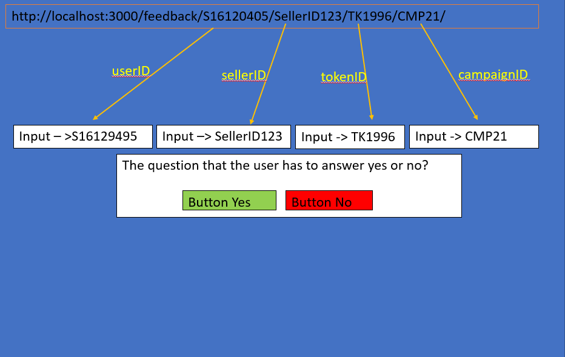
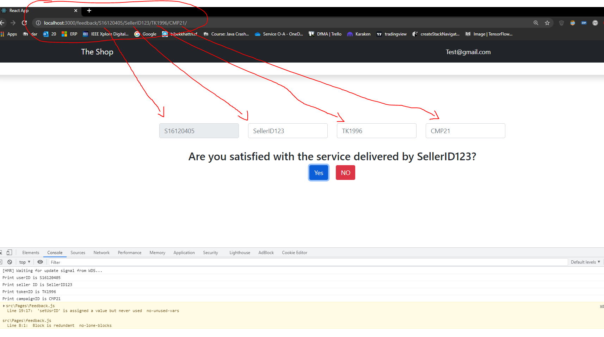

# Test 1ST UI React JS

=)


## Installation
```bash
npm start
```

## Usage
```
http://localhost:3000/feedback/S16120405/SellerID123/TK1996/CMP21/

```

## Requirments


## Output




## Intructions to run

Clone REPUTABLE Repo

```
git clone git@github.com:thelastjosh/REPUTABLE.git
```

The below instructions to run the project are derived from this document
https://github.com/thelastjosh/REPUTABLE/blob/prince/ONTOCHAIN_D4_REPUTABLE_VF.pdf

Please make sure to clone the `test-dev-rashmi` branch
and also you are using Node v16, if not
```
nvm use 16
```


(Terminal 1):
```
pip install -r requirements.txt
npm install
```

(Terminal 2):
`ganache-cli `

(Terminal 3):
```
truffle compile
truffle migrate --network development
```

after compiling and deploying the contracts,
please update the contract addresses for each smart contract in the src/Pages/Feedback.js and .env file

now please run 
`python3 setOracle.py `

a successful transaction should look like this


(Terminal 1):
`npm run start`

(Terminal 4):
`python3 oracle2.py`

(Terminal 5):
`python3 ./swagger/swaggerAPI.py`

Note: This is an input data document that the script uses
https://firestore.googleapis.com/v1/projects/reputable-b7df1/databases/(default)/documents/individual_scores/mjHPrqCFPf8y3vAJ9vE1

https://hackmd.io/MC_QqPFTQTe3b1d5bUg62g

# REPUTABLE Smart Contracts deployment
#### Helpful links
https://ontochain.ngi.eu/content/reputable-provenance-aware-decentralized-reputation-system-blockchain-based-ecosystems

https://www.researchgate.net/publication/356890067_A_New_Blockchain_Ecosystem_for_Trusted_Traceable_and_Transparent_Ontological_Knowledge_Management_Position_Paper

## Deployed Smart Contract Addresses
Testnet: Sepolia

### OnChainReputationData.sol :  
`0x206e22fD482ae75306FF1869E852A3D9Ae48FE76`
https://sepolia.etherscan.io/address/0x206e22fD482ae75306FF1869E852A3D9Ae48FE76#code

### DataService.sol : 
`0xfEb6Cf237c031a2d6c97E8E415064A3d1126232A` 
https://sepolia.etherscan.io/address/0xfEb6Cf237c031a2d6c97E8E415064A3d1126232A#code

### Gateway.sol : 
`0xe402996DEea7a76bfB4FB0BdC648802952840207`
https://sepolia.etherscan.io/address/0xe402996DEea7a76bfB4FB0BdC648802952840207#code

### Oracle.sol : 
`0x13441a7B32E4D012a657Bc0794Fb9BF5717f186F`
https://sepolia.etherscan.io/address/0x13441a7B32E4D012a657Bc0794Fb9BF5717f186F#code

